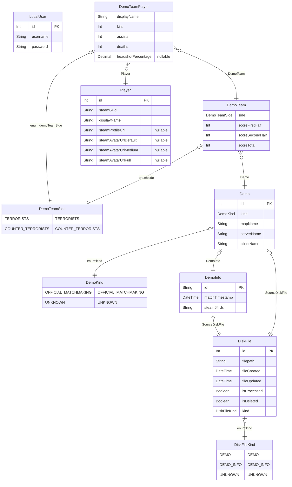

```mermaid
erDiagram

        DiskFileKind {
            DEMO DEMO
DEMO_INFO DEMO_INFO
UNKNOWN UNKNOWN
        }
    


        DemoKind {
            OFFICIAL_MATCHMAKING OFFICIAL_MATCHMAKING
UNKNOWN UNKNOWN
        }
    


        DemoTeamSide {
            TERRORISTS TERRORISTS
COUNTER_TERRORISTS COUNTER_TERRORISTS
        }
    
  LocalUser {
    Int id PK 
    String username  
    String password  
    }
  

  DiskFile {
    Int id PK 
    String filepath  
    DateTime fileCreated  
    DateTime fileUpdated  
    Boolean isProcessed  
    Boolean isDeleted  
    DiskFileKind kind  
    }
  

  Demo {
    Int id PK 
    DemoKind kind  
    String mapName  
    String serverName  
    String clientName  
    }
  

  DemoTeam {
    DemoTeamSide side  
    Int scoreFirstHalf  
    Int scoreSecondHalf  
    Int scoreTotal  
    }
  

  DemoTeamPlayer {
    String displayName  
    Int kills  
    Int assists  
    Int deaths  
    Decimal headshotPercentage  "nullable"
    }
  

  DemoInfo {
    String id PK 
    DateTime matchTimestamp  
    String steam64Ids  
    }
  

  Player {
    Int id PK 
    String steam64Id  
    String displayName  
    String steamProfileUrl  "nullable"
    String steamAvatarUrlDefault  "nullable"
    String steamAvatarUrlMedium  "nullable"
    String steamAvatarUrlFull  "nullable"
    }
  
    DiskFile o|--|| DiskFileKind : "enum:kind"
    Demo o|--|| DemoKind : "enum:kind"
    Demo o|--|| DiskFile : "SourceDiskFile"
    Demo o|--|| DemoInfo : "DemoInfo"
    DemoTeam o|--|| DemoTeamSide : "enum:side"
    DemoTeam o{--|| Demo : "Demo"
    DemoTeamPlayer o{--|| DemoTeam : "DemoTeam"
    DemoTeamPlayer o|--|| DemoTeamSide : "enum:demoTeamSide"
    DemoTeamPlayer o{--|| Player : "Player"
    DemoInfo o|--|| DiskFile : "SourceDiskFile"
```
